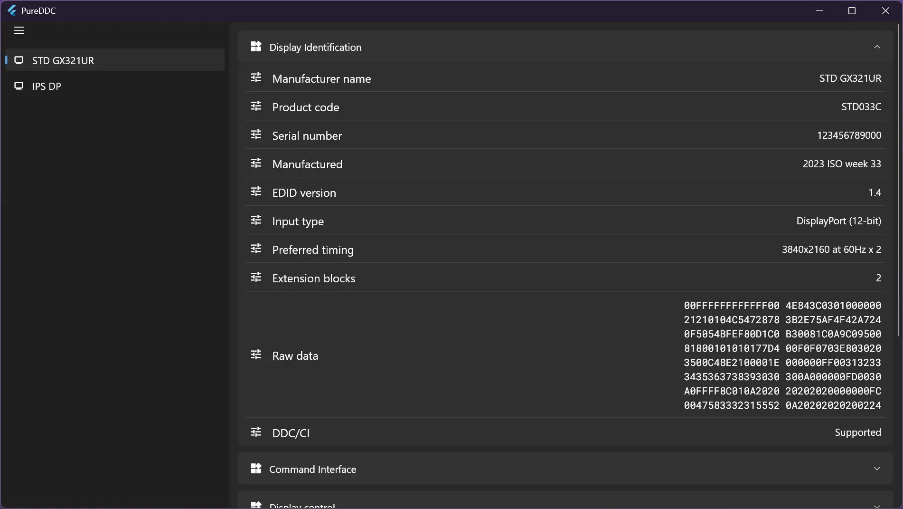
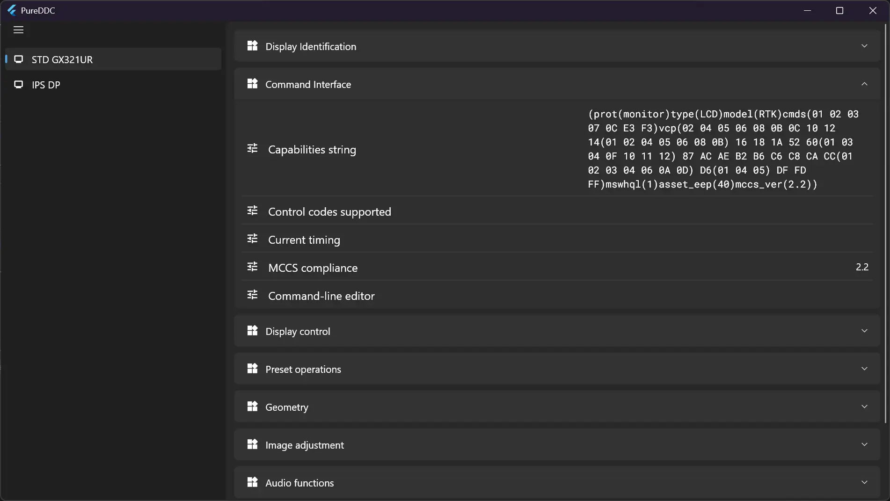
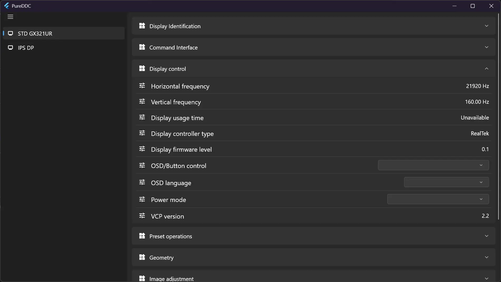
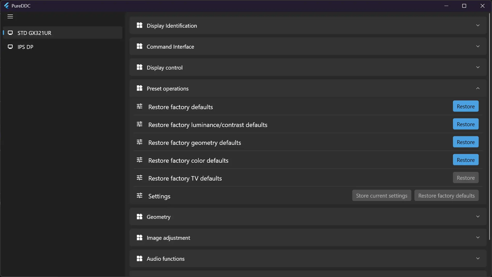
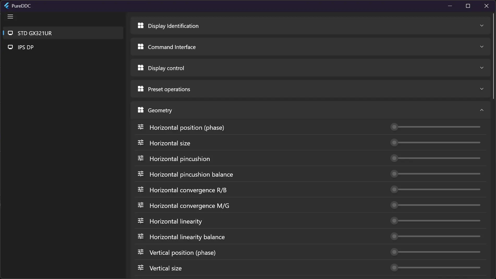
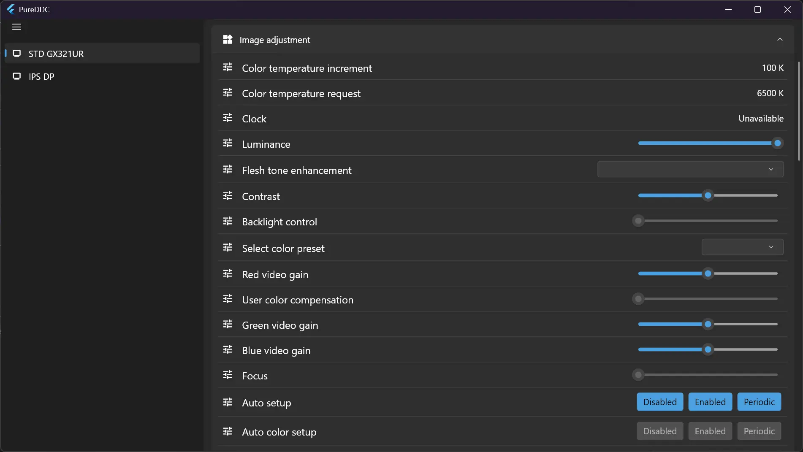
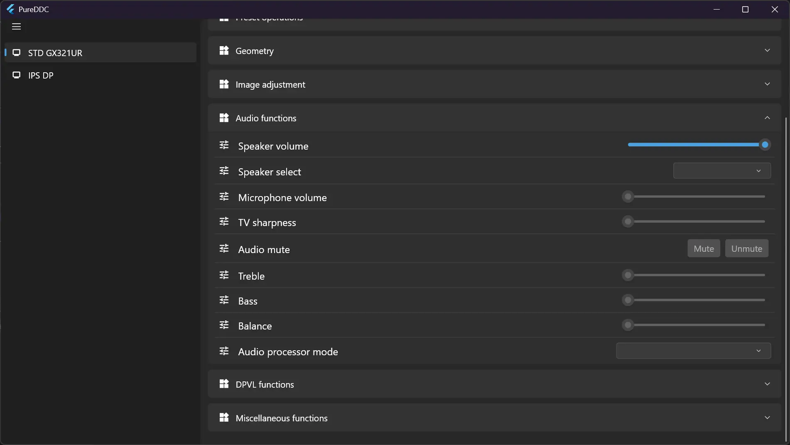
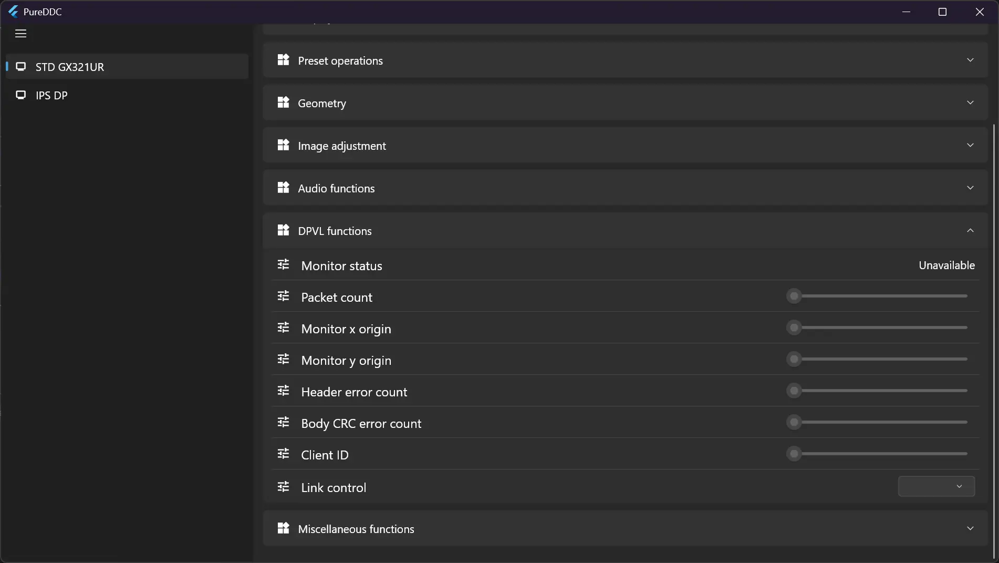
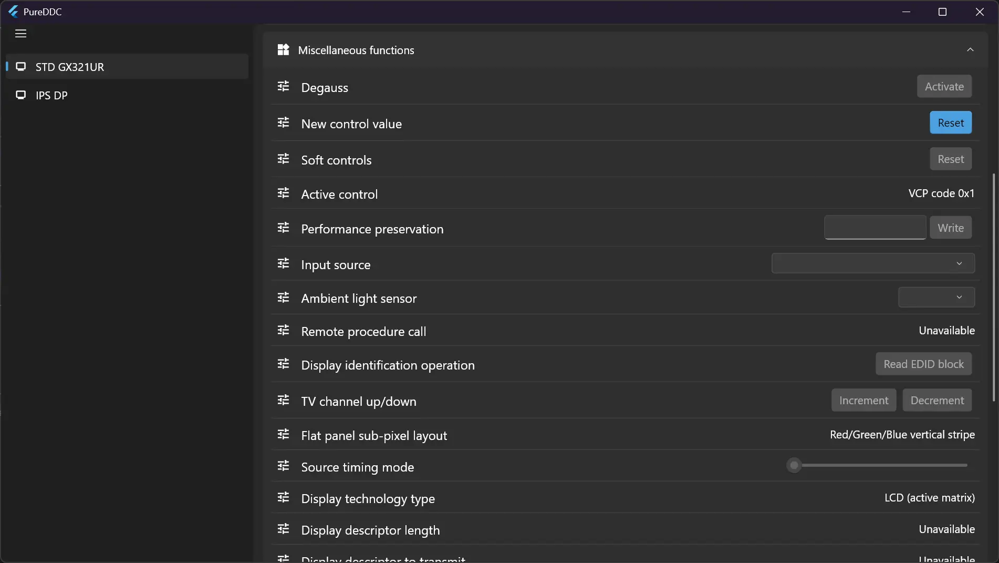

<p align="center">
  
</p>

# Monitor

一款基于 DDC/CI 协议的显示器硬件控制工具，支持通过软件直接调节亮度、色彩、几何参数等显示器设置，支持 Windows 平台。

## 界面预览

<div align="center">
  
</div>

<details>
<summary>查看更多界面截图</summary>

<div align="center">
  
  <br><br>
  
  <br><br>
  
  <br><br>
  
  <br><br>
  
  <br><br>
  
  <br><br>
  
  <br><br>
  
</div>

</details>

## 快速开始

### 系统要求

- Windows 10/11
- 支持 DDC/CI 协议的显示器
- Flutter SDK 3.11 或更高版本

### 启用 DDC/CI

在使用本工具前，请确保显示器的 DDC/CI 功能已启用：

1. 进入显示器的 OSD 菜单
2. 找到 "DDC/CI" 或 "外部控制" 选项
3. 将其设置为 "开启" 或 "启用"

### 快速开始

```bash
# 克隆仓库
git clone https://github.com/halifox/PureDDCCI.git
cd PureDDCCI

# 安装依赖
flutter pub get

# 生成代码
flutter pub run build_runner build

# 运行应用
flutter run -d windows

# 构建发布版本
flutter build windows --release

# 构建便携版
Compress-Archive -Path build\windows\x64\runner\Release\* -DestinationPath PureDDCCI_Portable_v1.0.0.zip

# 构建安装程序
# 下载并安装 [Inno Setup](https://jrsoftware.org/isdl.php)
# 生成的安装程序位于 `installer_output\PureDDCCI_Setup_v1.0.0.exe`
ISCC.exe ./installer.iss
```

## 技术栈

- **UI 框架** - Flutter 3.11+ / Fluent UI 4.15+
- **状态管理** - Riverpod 3.3+ / Hooks Riverpod / Flutter Hooks
- **原生交互** - Dart FFI (Foreign Function Interface)
- **DDC/CI 通信** - Windows Dxva2.dll API
- **字体** - Google Fonts
- **代码生成** - Riverpod Generator / Build Runner

## 平台支持

本项目仅支持 **Windows** 平台。

macOS 和 Linux 平台已有更成熟的显示器控制工具（如 macOS 的 MonitorControl、Linux 的 ddcutil 等），因此本项目专注于为 Windows 用户提供简洁易用的 DDC/CI 控制体验。


## 许可证

本项目遵循 [GPL-3.0 License](LICENSE)。