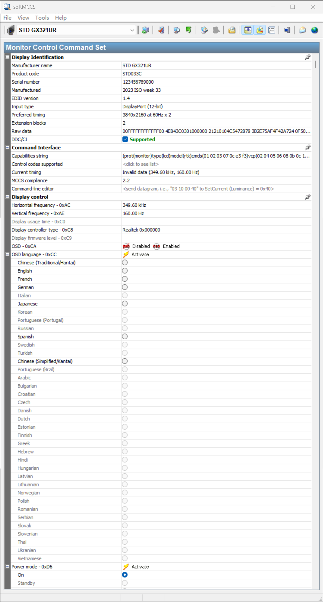
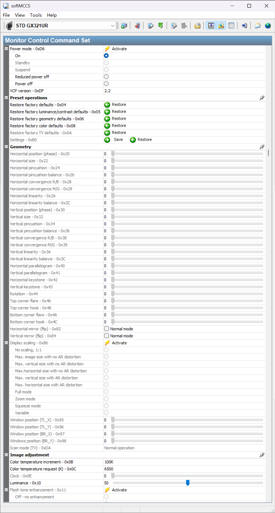
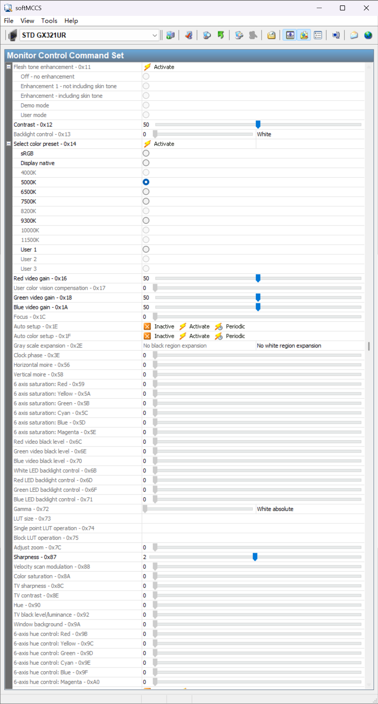
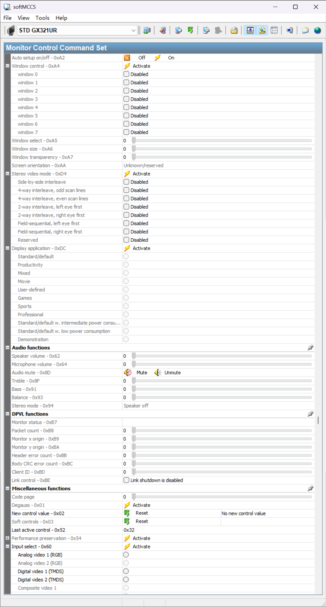

# PureDDC 显示器控制中心

<div align="center">


一个基于 Flutter 开发的 Windows 显示器 DDC/CI 控制工具，提供直观的图形界面来调整显示器的各项参数。

[功能特性](#功能特性) • [快速开始](#快速开始) • [使用说明](#使用说明) • [技术架构](#技术架构)

</div>

---

## 界面预览

<div align="center">
  
  
</div>

<div align="center">
  
  
</div>

## 功能特性

### 显示器识别
- 自动检测连接的物理显示器
- 显示制造商信息和产品代码
- DDC/CI 协议支持状态检测
- MCCS 版本识别

### 图像调整
- **亮度与对比度**：精确调节显示亮度和对比度
- **色彩控制**：RGB 增益和黑电平独立调节
- **色温预设**：多种色温模式快速切换
- **背光控制**：支持背光亮度调节
- **锐度调整**：图像清晰度微调

### 几何校正
- 水平/垂直位置调整
- 尺寸和相位控制
- 枕形失真校正
- 梯形失真校正
- 镜像和缩放设置

### 音频功能
- 扬声器音量控制
- 麦克风音量调节
- 音频静音开关
- 高音/低音均衡器
- 立体声模式选择

### 显示控制
- 电源模式管理
- OSD 菜单语言设置
- OSD 启用/禁用
- 输入源切换
- 固件版本查看
- 使用时间统计

### 预设操作
- 恢复出厂默认设置
- 恢复亮度/对比度默认值
- 恢复几何参数默认值
- 恢复色彩默认值

## 快速开始

### 系统要求

- Windows 10/11
- 支持 DDC/CI 协议的显示器
- Flutter SDK 3.11 或更高版本

### 安装步骤

1. **克隆仓库**
```bash
git clone https://github.com/yourusername/ddcci.git
cd ddcci
```

2. **安装依赖**
```bash
flutter pub get
```

3. **生成代码**
```bash
flutter pub run build_runner build
```

4. **运行应用**
```bash
flutter run -d windows
```

### 构建发布版本

```bash
flutter build windows --release
```

构建完成后，可执行文件位于 `build\windows\x64\runner\Release\` 目录。

## 使用说明

### 启用 DDC/CI

在使用本工具前，请确保显示器的 DDC/CI 功能已启用：

1. 进入显示器的 OSD 菜单
2. 找到"DDC/CI"或"外部控制"选项
3. 将其设置为"开启"或"启用"

### 基本操作

1. **选择显示器**：启动应用后，左侧导航栏会列出所有检测到的显示器
2. **调整参数**：点击展开各个功能组，使用滑块或下拉框调整参数
3. **实时生效**：大部分调整会立即应用到显示器
4. **恢复默认**：使用"预设操作"组中的功能恢复出厂设置

### VCP 代码参考

本工具实现了 MCCS（Monitor Control Command Set）标准中的大部分 VCP 代码。详细的代码映射关系请参考 [DDC/CI 代码参考文档](docs/DDCCI_CODE_REFERENCE.md)。

## 技术架构

### 核心技术栈

- **UI 框架**：Flutter + Fluent UI（Windows 风格）
- **状态管理**：Riverpod + Hooks
- **原生交互**：FFI（Foreign Function Interface）
- **DDC/CI 通信**：Windows API（Dxva2.dll）

### 项目结构

```
lib/
├── main.dart                          # 应用入口和主界面
├── src/
│   ├── pureddc/
│   │   ├── windows_pureddc.dart      # Windows DDC/CI 原生接口
│   │   ├── capabilities_parser.dart   # 显示器能力字符串解析
│   │   └── models.dart                # 数据模型定义
│   └── n.dart                         # UI 组件和业务逻辑
docs/
└── DDCCI_CODE_REFERENCE.md            # VCP 代码参考文档
```

### 核心模块

#### 1. DDC/CI 通信层
通过 FFI 调用 Windows Dxva2.dll，实现与显示器的底层通信：
- `GetNumberOfPhysicalMonitorsFromHMONITOR`：枚举物理显示器
- `GetVCPFeatureAndVCPFeatureReply`：读取 VCP 特性值
- `SetVCPFeature`：设置 VCP 特性值
- `CapabilitiesRequestAndCapabilitiesReply`：获取显示器能力字符串

#### 2. 能力解析器
解析显示器返回的 Capabilities String，提取：
- 支持的 VCP 代码列表
- MCCS 版本信息
- 显示器型号
- 命令接口支持情况

#### 3. UI 组件系统
基于 Fluent UI 构建的响应式组件：
- `SoftGroup`：可折叠的功能分组
- `SliderListTile`：滑块控制组件
- `ComboBoxListTile`：下拉选择组件
- `ActionListTile`：操作按钮组件
- `TextListTile`：文本显示组件

## 支持的 VCP 代码

| 类别 | 已实现 | 占位符 |
|------|--------|--------|
| 显示器识别 | 3 | 7 |
| 命令接口 | 3 | 2 |
| 显示控制 | 6 | 2 |
| 预设操作 | 5 | 0 |
| 几何调整 | 26 | 4 |
| 图像调整 | 18 | 28 |
| 音频功能 | 7 | 0 |
| DPVL 功能 | 0 | 8 |
| 其他功能 | 7 | 13 |
| 厂商特定 | 2 | 28 |

详细列表请查看 [代码参考文档](docs/DDCCI_CODE_REFERENCE.md)。

## 贡献指南

欢迎提交 Issue 和 Pull Request！

### 开发建议

1. 遵循 Flutter 官方代码规范
2. 使用 `flutter analyze` 检查代码质量
3. 新增 VCP 代码支持时，请更新文档
4. 测试时注意不同品牌显示器的兼容性

## 许可证

本项目采用 MIT 许可证。详见 [LICENSE](LICENSE) 文件。

## 致谢

- [Flutter](https://flutter.dev/) - 跨平台 UI 框架
- [Fluent UI](https://pub.dev/packages/fluent_ui) - Windows 风格组件库
- [Riverpod](https://riverpod.dev/) - 状态管理解决方案
- VESA MCCS 标准 - DDC/CI 协议规范
